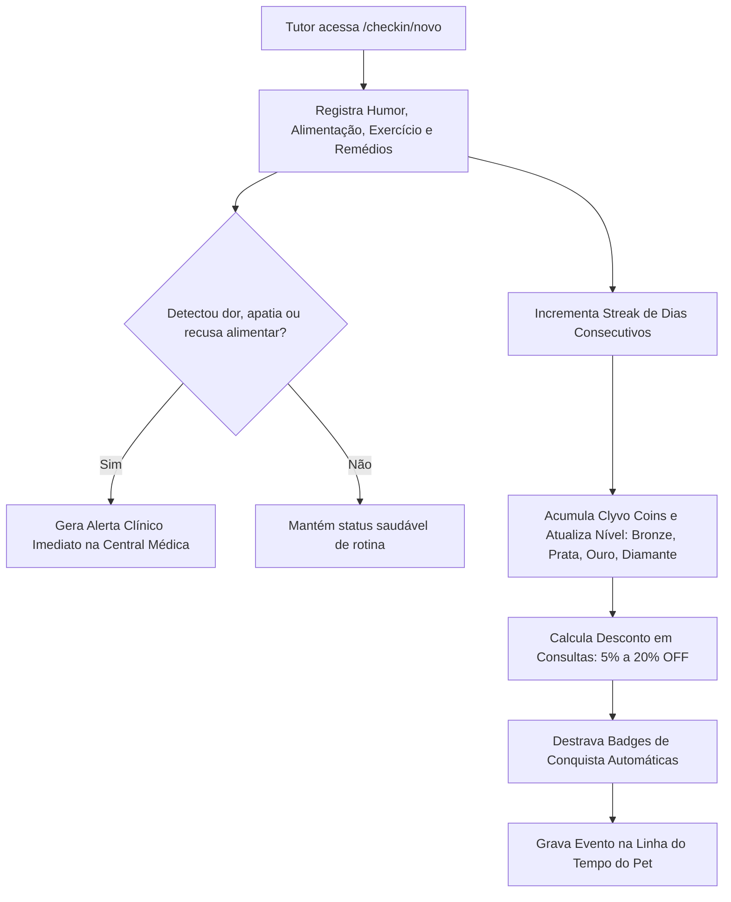
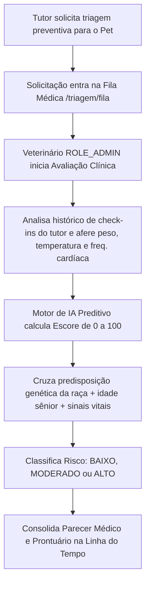

<div align="center">

# 🐾 Clyvo Vet
### **Plataforma Web de Medicina Preventiva, Longevidade & Gamificação Pet**
*Entrega 3º Sprint — Java Advanced (FIAP)*

[](https://www.oracle.com/java/)
[](https://spring.io/projects/spring-boot)
[](https://spring.io/projects/spring-security)
[](https://flywaydb.org/)
[](https://www.thymeleaf.org/)
[](https://getbootstrap.com/)
[](LICENSE)

<p align="center">
  <a href="#-sobre-o-projeto">Sobre o Projeto</a> •
  <a href="#-rubrica-da-sprint-100-pts">Critérios Técnicos</a> •
  <a href="#-recursos--funcionalidades">Funcionalidades</a> •
  <a href="#-credenciais-de-acesso">Acesso</a> •
  <a href="#-tecnologias">Tecnologias</a> •
  <a href="#-como-executar">Como Executar</a> •
  <a href="#-fluxos-de-negócio-completos">Fluxos de Negócio</a> •
  <a href="#-estrutura-do-projeto">Estrutura</a> •
  <a href="#-contribuindo">Contribuindo</a>
</p>

</div>

---

## 📖 Sobre o Projeto

O **Clyvo Vet** nasceu para combater uma das maiores dores da saúde animal: o **cuidado veterinário reativo e episódico**. A maioria dos tutores só leva seus companheiros ao consultório quando sintomas graves já estão instalados, encarecendo tratamentos e reduzindo drasticamente a sobrevida e qualidade de vida do pet.

A plataforma introduz uma abordagem orientada à **medicina preventiva contínua**:
- **Para o Tutor:** Uma experiência de **gamificação diária** baseada em check-ins de hábitos (dieta, hidratação, humor, atividades físicas e medicação rigorosa), acumulando sequências de dias (*streaks*), badges exclusivas e **Clyvo Coins** conversíveis em descontos reais em consultas e exames (até 20% OFF).
- **Para a Equipe Clínica:** Uma **central médica preditiva** que analisa o prontuário e alimenta um **motor de escore de longevidade (0 a 100)**, correlacionando predisposições genéticas das raças, biometria e alertas de apatia em tempo real.

---

## 🎯 Rubrica da Sprint (100 Pts Atendidos)

| Requisito do Edital | Pontos | Abordagem Técnica Implementada |
| :--- | :---: | :--- |
| **1. Camada de Visualização (Frontend)** | **30 pts** | Telas completas em **Thymeleaf + Bootstrap 5.3 + Bootstrap Icons**, layout responsivo (*mobile-friendly*), componentes reativos de gamificação, dashboards dedicados e **zero links quebrados**. |
| **2. Flyway Migrations** | **20 pts** | Controle estrito de esquema em `src/main/resources/db/migration/`: `V1__criar_tabelas_base.sql`, `V2__criar_tabelas_fluxos_clinicos.sql` e `V3__inserir_dados_iniciais.sql`. O Hibernate está configurado com `ddl-auto=none` garantindo que o Flyway seja a única fonte da verdade. |
| **3. Spring Security** | **30 pts** | Autenticação via formulário customizado (`/login`), controle de sessão, senhas protegidas com hashing criptográfico **BCrypt**, tokens CSRF ativos e autorização estrita por perfis: `ROLE_ADMIN` (Veterinários) e `ROLE_TUTOR` (Tutores). |
| **4. Funcionalidades Completas (Sem CRUD)** | **20 pts** | **Dois fluxos ricos não-CRUD** implementados ponta a ponta: <br>• **Fluxo 1:** Check-in diário com cálculo de streaks, pontuação, descontos, desbloqueio de badges e alertas automáticos de sintomas à clínica.<br>• **Fluxo 2:** Fila de triagem preventiva com algoritmo de longevidade IA, classificação de risco genético/biométrico e linha do tempo clínica. |
| **Qualidade & SOLID** | **Sem Penalidades** | Injeção de dependências por construtor, Bean Validation nos DTOs, métodos curtos e coesos, isolamento em camadas (Controller, Service, Repository, DTO, Model). |

---

## 👥 Credenciais de Acesso

Ao inicializar o sistema, o banco de dados é populado com as seguintes contas pré-configuradas (senhas criptografadas com **BCrypt**):

| Papel no Sistema | Usuário | Senha | Permissões & Módulos |
| :--- | :--- | :--- | :--- |
| **Veterinário / Clínica (`ROLE_ADMIN`)** | `admin` | `admin123` | Central Médica, Alertas de Saúde em tempo real, Fila de Triagem Preventiva com IA (`/triagem/fila`) e Prontuário Geral. |
| **Tutor de Pet (`ROLE_TUTOR`)** | `tutor` | `tutor123` | Painel do Tutor (`/dashboard`), Cadastro de Pets, Check-in Diário de Cuidado (`/checkin/novo`), Clube de Recompensas (`/checkin/recompensas`) e Solicitação de Triagem. |

> 🔒 **Segurança Ativa:** Se um usuário logado como `ROLE_TUTOR` tentar acessar rotas médicas protegidas como `/triagem/fila`, o Spring Security bloqueia a requisição imediatamente com **HTTP 403 (Acesso Negado)**.

---

## 🔄 Fluxos de Negócio Completos

### 🎮 Fluxo 1: Gamificação, Streaks e Check-in Diário (Tutor)


### 🩺 Fluxo 2: Triagem Preventiva & Escore de Longevidade IA (Veterinário)


---

## 💻 Tecnologias Utilizadas

- **Linguagem:** Java 21 / OpenJDK 26
- **Framework:** Spring Boot 3.3.4
- **Segurança:** Spring Security 6 (BCrypt, CSRF, DaoAuthenticationProvider, MethodSecurity)
- **Persistência:** Spring Data JPA / Hibernate
- **Migrações:** Flyway Migration 10.10.0
- **Banco de Dados:** H2 Database (em memória, modo Oracle)
- **Template Engine:** Thymeleaf com dialeto Spring Security
- **Design & UI:** Bootstrap 5.3 + Bootstrap Icons + Google Fonts (Plus Jakarta Sans)
- **Validação:** Jakarta Bean Validation (Hibernate Validator)
- **Build Tool:** Apache Maven 3.9+

---

## 🚀 Como Executar

### Pré-requisitos
- **Java JDK 17+** instalado
- **Maven 3.8+** instalado
- **Git** instalado

### Passo a Passo

1. **Clone o repositório:**
```bash
git clone https://github.com/Gabriel-Maciel06/clyvo-vet-web.git
cd clyvo-vet-web
```

2. **Compile e empacote a aplicação:**
```bash
mvn clean package -DskipTests
```

3. **Execute a aplicação:**
```bash
java -jar target/clyvo-vet-web-1.0.0.jar
```

4. **Acesse no seu navegador:**
- 🌐 **Aplicação Web:** [http://localhost:8095](http://localhost:8095)
- 🗄️ **Console H2 Database:** [http://localhost:8095/h2-console](http://localhost:8095/h2-console)
  - **JDBC URL:** `jdbc:h2:mem:clyvodb`
  - **User Name:** `sa`
  - **Password:** *(deixe em branco)*

---

## 📁 Estrutura do Projeto

```
clyvo-vet-web/
├── docs/
│   ├── GUIA_AVALIACAO_ORAL.md       # Roteiro de pitch e perguntas da banca FIAP
│   └── ROTEIRO_GRAVACAO_VIDEO.md    # Script minuto a minuto para gravação do vídeo
├── src/
│   ├── main/
│   │   ├── java/com/fiap/clyvovet/
│   │   │   ├── ClyvoVetApplication.java
│   │   │   ├── config/
│   │   │   │   └── SecurityConfig.java         # Regras de autenticação, roles e rotas
│   │   │   ├── controller/
│   │   │   │   ├── AuthController.java         # /login e /access-denied
│   │   │   │   ├── HomeController.java         # /dashboard inteligente por role
│   │   │   │   ├── PetController.java          # Gestão e linha do tempo dos pets
│   │   │   │   ├── CheckinController.java      # Fluxo 1: Check-in e Recompensas
│   │   │   │   └── TriagemController.java      # Fluxo 2: Fila médica e avaliação IA
│   │   │   ├── dto/                            # DTOs com Jakarta Bean Validation
│   │   │   ├── model/                          # Entidades JPA (Pet, Usuario, Tutor, etc.)
│   │   │   ├── repository/                     # Interfaces Spring Data JPA
│   │   │   └── service/                        # Regras de negócio e motor preditivo IA
│   │   └── resources/
│   │       ├── application.properties
│   │       ├── db/migration/                   # Scripts versionados pelo Flyway (V1, V2, V3)
│   │       └── templates/                      # Telas Thymeleaf (checkin, triagem, pets, etc.)
│   └── test/                                   # Testes unitários e de integração
├── pom.xml
└── README.md
```

---

## 🤝 Contribuindo

Contribuições são muito bem-vindas! Siga os passos abaixo para submeter melhorias:

1. Faça um **Fork** do projeto
2. Crie uma **Branch** para sua funcionalidade:
   ```bash
   git checkout -b feature/NovaFuncionalidade
   ```
3. Faça o **Commit** de suas alterações utilizando [Conventional Commits](https://gist.github.com/joshbuchea/6f47e86d2510bce28f8e7f42ae84c716):
   ```bash
   git commit -m "feat: adiciona nova funcionalidade de teleorientacao"
   ```
4. Faça o **Push** para a sua Branch:
   ```bash
   git push origin feature/NovaFuncionalidade
   ```
5. Abra um **Pull Request** explicando claramente o problema resolvido ou recurso adicionado, anexando screenshots se houver alterações visuais!
> [Tutorial: Como criar um Pull Request no GitHub](https://www.atlassian.com/br/git/tutorials/making-a-pull-request)

---

## 📜 Licença

Este projeto é distribuído sob a licença **MIT**. Consulte o arquivo [LICENSE](LICENSE) para obter mais detalhes.

---

<div align="center">
  <sub>Desenvolvido com 💚 por <strong>Gabriel Maciel</strong> para a 3ª Sprint de Java Advanced — FIAP.</sub>
</div>
